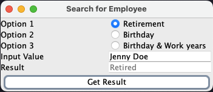

# Employee Management System

This project implements a simple client-server application for managing employee data. The server handles requests from clients, such as querying employee information or performing searches based on different criteria. The client provides a graphical user interface (GUI) for users to interact with the server.

## How it Works

### Server Side

The server is implemented in Java and listens for incoming connections on port 7777. When a client connects, the server accepts the connection and handles client requests. It reads input from the client, processes it based on specified criteria, and sends back the results.

The server reads employee data from a text file located at `src/main/resources/employee.txt`. It supports three types of queries:
1. Search by employee name to determine retirement status.
2. Count employees with a specific birthdate.
3. Count employees hired on a specific birthdate and date of employment.

### Client Side

The client is also implemented in Java and provides a Swing-based GUI for users to interact with the server. It allows users to select different search options, enter input values, and retrieve results from the server.

The client sends requests to the server based on user input and displays the results in the GUI.

## Screenshots


## Usage

To use this project, follow these steps:

1. Clone the repository to your local machine:

```bash
   git clone https://github.com/decodevm/ihm_tcp_socket.git
```
2. Navigate to the tcp-socket/src/main/java/com/decodev/additional directory:

```bash
   cd ihm_tcp_socket/src/main/java/com/decodev/additional
```
3. Compile the Java files:

```bash
   javac EmployeeClient.java EmployeeServer.java
```
4. Run the server for employee system:

```bash
   java EmployeeServer
```

5. Connect your client application to the server using TCP socket programming:

```bash
   java EmployeeClient
```

## Contributors

This project was developed by:

- [Abdelghani Yacine BARKA](https://github.com/decodevm)
- [Nardjes Sara KHIAT](https://github.com/Nardjes03)
